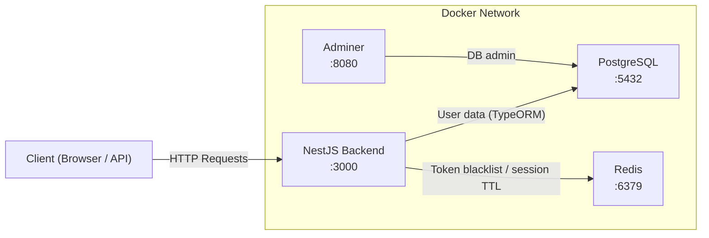
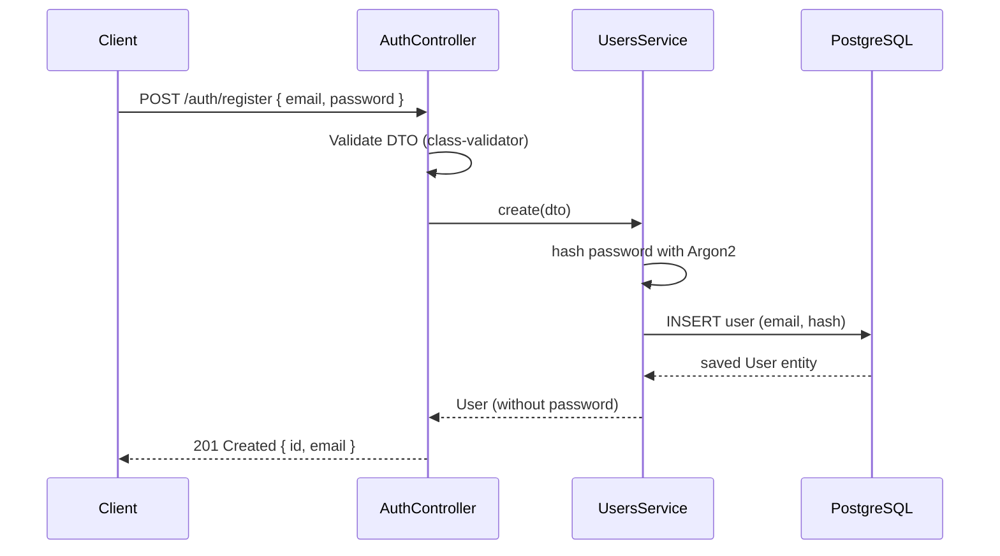
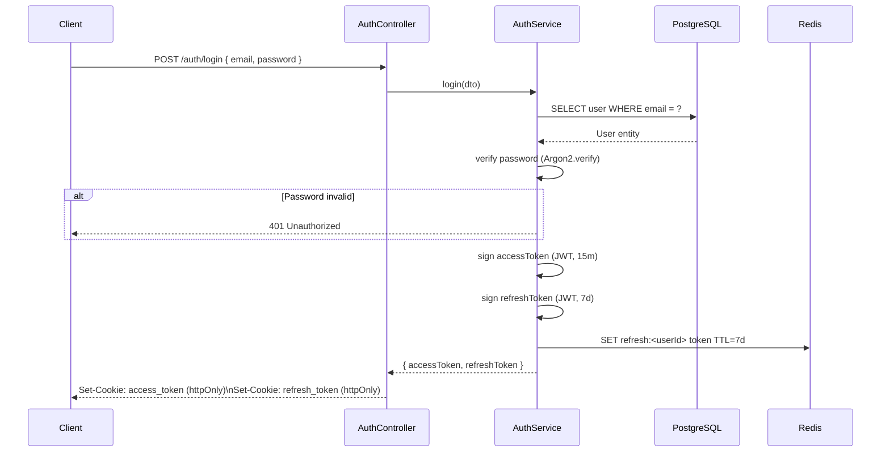
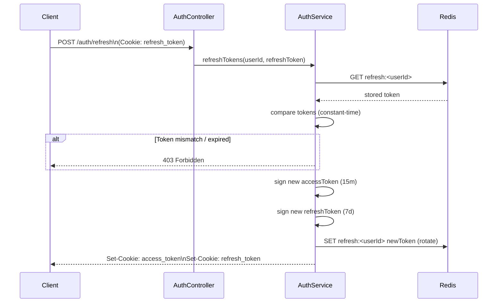
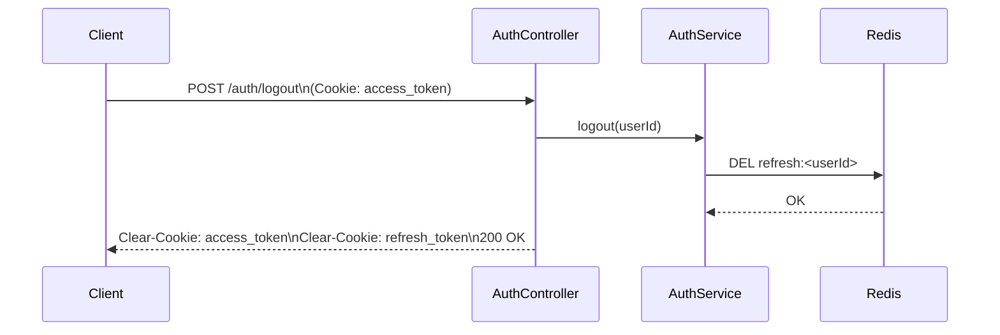
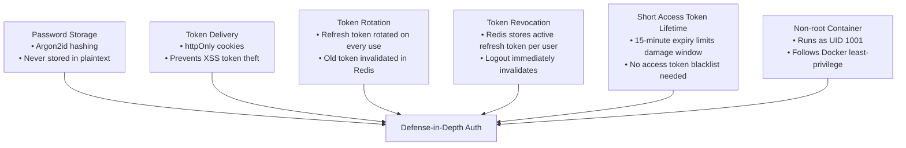

# auth
 
> **A production-ready JWT authentication microservice** built with [NestJS](https://nestjs.com/), PostgreSQL, and Redis. Implements a secure access/refresh token strategy with Argon2 password hashing, HTTP-only cookies, and token blacklisting.
 
---
 
## Table of Contents
 
- [Overview](#overview)
- [Tech Stack](#tech-stack)
- [Architecture](#architecture)
- [Authentication Flow](#authentication-flow)
  - [Registration](#registration-flow)
  - [Login](#login-flow)
  - [Token Refresh](#token-refresh-flow)
  - [Logout](#logout-flow)
- [Project Structure](#project-structure)
- [Environment Variables](#environment-variables)
- [Getting Started](#getting-started)
  - [Docker (Recommended)](#docker-recommended)
  - [Local Development](#local-development)
- [API Reference](#api-reference)
- [Security Design](#security-design)
- [Infrastructure](#infrastructure)
- [Testing](#testing)
---
 
## Overview
 
ARM-auth is a standalone authentication service designed to be composed into a larger microservices architecture. It handles:
 
- **User registration** with Argon2-hashed passwords
- **JWT-based login** issuing short-lived access tokens and long-lived refresh tokens
- **Token refresh** with refresh token rotation (old tokens invalidated on use)
- **Logout** with active token blacklisting via Redis
- **Protected route guarding** via Passport.js JWT strategy
---
 
## Tech Stack
 
| Layer | Technology |
|---|---|
| Framework | NestJS 11 (TypeScript) |
| Database | PostgreSQL 16 (via TypeORM) |
| Cache / Token Store | Redis (ioredis) |
| Password Hashing | Argon2 |
| Auth Strategy | Passport.js + `passport-jwt` |
| Token Format | JWT (access + refresh) |
| Cookie Handling | `cookie-parser` |
| Validation | `class-validator` + `class-transformer` |
| Config & Validation | `@nestjs/config` + Joi schema |
| Runtime | Node.js 20 (Alpine) |
| Package Manager | pnpm |
| Containerisation | Docker + Docker Compose |
 
---
 
## Architecture
 
The service is composed of three containers that communicate over a private Docker network:
 
```
┌─────────────────────────────────────────────────────┐
│                   Docker Compose                    │
│                                                     │
│  ┌──────────────┐   ┌──────────┐   ┌─────────────┐ │
│  │   backend    │──▶│ postgres │   │    redis    │ │
│  │  NestJS :3000│   │  :5432   │   │    :6379    │ │
│  │              │◀──│          │   │             │ │
│  │              │──────────────────▶             │ │
│  └──────────────┘   └──────────┘   └─────────────┘ │
│                                                     │
│  ┌──────────────┐                                   │
│  │   adminer    │ (DB admin UI — :8080)             │
│  └──────────────┘                                   │
└─────────────────────────────────────────────────────┘
```
 

 
---
 
## Authentication Flow
 
### Registration Flow
 

 
---
 
### Login Flow
 

 
**Key security properties of login:**
- Passwords are never stored in plaintext — Argon2 hashes are compared in constant time.
- Both tokens are delivered as `httpOnly` cookies, preventing JavaScript access.
- The refresh token is stored in Redis and used for single-use invalidation.
---
 
### Token Refresh Flow
 

 
> **Token Rotation:** Each refresh invalidates the previous refresh token. If a stolen token is used after the legitimate user has already rotated, it will fail immediately.
 
---
 
### Logout Flow
 

 
---
 
## Project Structure
 
```
arm-auth/
├── src/
│   ├── app.module.ts           # Root module — wires config, DB, Redis, feature modules
│   ├── main.ts                 # Bootstrap: cookie-parser, global pipes, CORS
│   │
│   ├── auth/
│   │   ├── auth.module.ts      # AuthModule — imports UsersModule, JwtModule
│   │   ├── auth.controller.ts  # Routes: /auth/register, /auth/login, /auth/logout, /auth/refresh
│   │   ├── auth.service.ts     # Core auth logic: token sign/verify, Argon2, Redis
│   │   ├── dto/
│   │   │   ├── create-auth.dto.ts   # Registration DTO (email, password)
│   │   │   └── login-auth.dto.ts    # Login DTO
│   │   └── strategies/
│   │       ├── jwt-access.strategy.ts   # Passport strategy for access tokens
│   │       └── jwt-refresh.strategy.ts  # Passport strategy for refresh tokens
│   │
│   ├── users/
│   │   ├── users.module.ts
│   │   ├── users.service.ts    # CRUD wrapper over User entity
│   │   └── entities/
│   │       └── user.entity.ts  # TypeORM entity: id, email, passwordHash, createdAt
│   │
│   └── common/
│       ├── guards/
│       │   ├── jwt-access.guard.ts   # Guards protected routes
│       │   └── jwt-refresh.guard.ts  # Guards /auth/refresh
│       └── decorators/
│           └── current-user.decorator.ts  # Extracts user from request
│
├── test/
│   ├── app.e2e-spec.ts         # End-to-end tests (supertest)
│   └── jest-e2e.json
│
├── Dockerfile                  # Multi-stage build (builder → production)
├── compose.yaml                # Docker Compose: backend + postgres + redis + adminer
├── nest-cli.json
├── tsconfig.json
└── package.json
```
 
---
 
## Environment Variables
 
These are configured in `compose.yaml` for local development. In production, override via a `.env` file or secrets manager.
 
| Variable | Description | Default (dev) |
|---|---|---|
| `DB_HOST` | PostgreSQL hostname | `db` |
| `DB_PORT` | PostgreSQL port | `5432` |
| `DB_USERNAME` | DB username | `postgres` |
| `DB_PASSWORD` | DB password | `foobarpassword` |
| `DB_NAME` | Database name | `arm_auth` |
| `REDIS_HOST` | Redis hostname | `redis` |
| `REDIS_PORT` | Redis port | `6379` |
| `REDIS_PASSWORD` | Redis password | `foobarpassword` |
| `REDIS_SESSION_TTL` | Refresh token TTL in seconds | `604800` (7 days) |
| `JWT_ACCESS_SECRET` | Secret for signing access tokens | ⚠️ change in production |
| `JWT_REFRESH_SECRET` | Secret for signing refresh tokens | ⚠️ change in production |
| `JWT_ACCESS_TTL` | Access token lifetime | `15m` |
| `JWT_REFRESH_TTL` | Refresh token lifetime | `7d` |
| `NODE_ENV` | Runtime environment | `development` |
 
> ⚠️ **Never ship the default secrets to production.** Generate strong random values for `JWT_ACCESS_SECRET` and `JWT_REFRESH_SECRET` (e.g. `openssl rand -hex 64`).
 
---
 
## Getting Started
 
### Docker (Recommended)
 
Requires Docker and Docker Compose.
 
```bash
# Clone the repo
git clone https://github.com/pirate329/auth.git
cd auth
 
# (Optional) copy and edit environment overrides
cp .env.example .env
 
# Start all services
docker compose up --build
 
# Services available at:
#   Backend API  →  http://localhost:3000
#   Adminer UI   →  http://localhost:8080
#   PostgreSQL   →  localhost:5432
#   Redis        →  localhost:6379
```
 
To stop and remove volumes:
 
```bash
docker compose down -v
```
 
---
 
### Local Development
 
Requires Node.js 20+, pnpm, a running PostgreSQL instance, and a running Redis instance.
 
```bash
# Install dependencies
pnpm install
 
# Set up your local .env (see Environment Variables above)
cp .env.example .env
# Edit .env with your local DB and Redis credentials
 
# Run in watch mode
pnpm run start:dev
 
# Build for production
pnpm run build
pnpm run start:prod
```
 
---
 
## API Reference
 
All tokens are delivered and consumed via **`httpOnly` cookies**. Do not pass tokens in `Authorization` headers unless you modify the JWT strategy extractors.
 
### `POST /auth/register`
 
Register a new user.
 
**Request body:**
```json
{
  "email": "user@example.com",
  "password": "SuperSecurePassword123!"
}
```
 
**Response `201`:**
```json
{
  "id": "uuid",
  "email": "user@example.com"
}
```
 
---
 
### `POST /auth/login`
 
Authenticate and receive tokens via cookies.
 
**Request body:**
```json
{
  "email": "user@example.com",
  "password": "SuperSecurePassword123!"
}
```
 
**Response `200`** — sets `access_token` and `refresh_token` cookies.
 
---
 
### `POST /auth/refresh`
 
Rotate the refresh token and get a new access token.
 
- Requires valid `refresh_token` cookie.
- The old refresh token is invalidated immediately.
**Response `200`** — sets new `access_token` and `refresh_token` cookies.
 
---
 
### `POST /auth/logout`
 
Invalidate the session.
 
- Requires valid `access_token` cookie.
- Deletes the refresh token from Redis.
- Clears both cookies.
**Response `200`**
 
---
 
### Protected Routes
 
Any route decorated with `@UseGuards(JwtAccessGuard)` requires a valid `access_token` cookie. The current user is available via the `@CurrentUser()` decorator.
 
---
 
## Security Design
 

 
| Threat | Mitigation |
|---|---|
| Password breach | Argon2id hashing — computationally expensive to crack |
| XSS token theft | Tokens in `httpOnly` cookies, inaccessible to JavaScript |
| Refresh token replay | Single-use rotation — reuse of a rotated token is rejected |
| Long-lived session abuse | Access tokens expire in 15 min; refresh tokens are revocable |
| Container privilege escalation | App runs as non-root user (`nestjs`, UID 1001) |
 
---
 
## Infrastructure
 
### Dockerfile — Multi-Stage Build
 
```
Stage 1: builder
  └── node:20-alpine
      ├── Install pnpm
      ├── Install ALL dependencies (dev + prod)
      └── Compile TypeScript → dist/
 
Stage 2: production
  └── node:20-alpine
      ├── Install pnpm
      ├── Install PROD-only dependencies
      ├── Copy dist/ from builder stage
      ├── Create non-root user (nestjs, UID 1001)
      └── EXPOSE 3000 → CMD ["node", "dist/main.js"]
```
 
This keeps the production image lean — TypeScript compiler and dev tooling are not included in the final image.
 
### Docker Compose Services
 
| Service | Image | Port | Purpose |
|---|---|---|---|
| `backend` | Built from `./Dockerfile` | `3000` | NestJS auth API |
| `db` | `postgres` (latest) | `5432` | Primary data store |
| `redis` | `redis:alpine` | `6379` | Token store, session TTL |
| `adminer` | `adminer` | `8080` | Browser-based DB admin UI |
 
**Volumes:**
- `db_data` — persists PostgreSQL data across restarts
- `redis_data` — persists Redis AOF log (append-only persistence enabled)
**Redis configuration:** `maxmemory 256mb`, `allkeys-lru` eviction policy, password-protected, append-only persistence.
 
---
